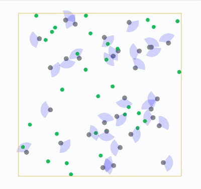

# MiniStage

This repository supports the paper "Noise-Enabled Goal Attainment in Crowded Collectives" by Lucy Liu, Justin Werfel, Federico Toschi, and L. Mahadevan. It contains data from the physical robot experiments (experiment_data folder) and code for running the simulations.

The MiniStage program simulates a collective of robots. It is inspired by the [Stage](https://github.com/rtv/Stage/tree/master) simulator, but it's more lightweight, and it is customized for fast simulation of very simple robots.

============================================================

## Installation: 

To run MiniStage, you will need
* C++17 and a C++ compiler
* cmake
* FLTK
* OpenGL

This software has been tested on an M1 Mac using the homebrew package manager and Xcode.

============================================================

## Build & run: 

After the packages are installed, build and run MiniStage using cmake. The steps below are written for Mac, but for a different operating system you can look up "how to compile and run a cmake project". 

* [Use cd in terminal to navigate to the folder you want to install in.]
* git clone git@github.com:lliu12/ministage.git
* mkdir ministage_build
* cd ministage_build
* cmake ../ministage  
* cmake --build .
* ./run_ministage

The executables are as follows.
* ./run_ministage: Run simulation of robots with local sensing based controllers with an animated visualization. 
* ./run_astar: Run our implementation of the [Cooperative A*](https://ojs.aaai.org/index.php/AIIDE/article/view/18726) global planning program with an animated visualization.
* ./ministage_results: Save data from simulations of robots with local sensing based controllers.
* ./astar_results: Save data from simulations of robots using the Cooperative A* planner.

============================================================
